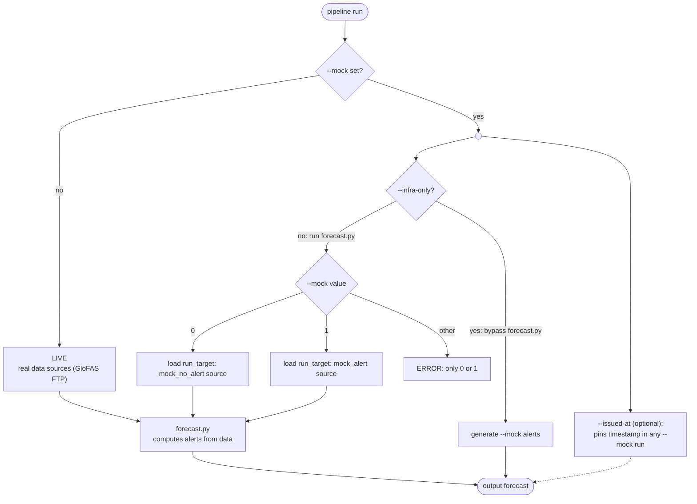

# Forecast Pipelines

Hazard-specific forecast implementations that use the pipeline infrastructure from `infra/`.

## Setup & Getting Started

### Setup

See the [data README](../README.md) for general Python/UV setup and dependency management.

### Running a pipeline

From the `<repo root>/data/` directory, for one country (or omit country-flag for all countries):

```bash
# Run with real data (requires FTP credentials)
uv run pipeline --config pipelines/infra/configs/floods.yaml --country ETH

# Run with mock data that triggers alerts
uv run pipeline --config pipelines/infra/configs/floods.yaml --country ETH --mock 1

# Run with mock data for all configured countries (no --country flag)
uv run pipeline --config pipelines/infra/configs/floods.yaml --mock 1

# Run only infra code with mock data (bypasses hazard logic in forecast.py)
uv run pipeline --config pipelines/infra/configs/floods.yaml --country ETH --mock 1 --infra-only
```

| Flag            | Description                                                                                                                                                                                                          |
| --------------- | -------------------------------------------------------------------------------------------------------------------------------------------------------------------------------------------------------------------- |
| `--config`      | Path to the hazard YAML config file (e.g. `pipelines/infra/configs/floods.yaml`)                                                                                                                                     |
| `--mock`        | _(optional)_ Run with mock data; value is the alert count (`0` = no-alert, `1` = alert). Omit for a LIVE run. Without `--infra-only` only `0` or `1` are allowed; with `--infra-only` any count `>= 0` is permitted. |
| `--infra-only`  | _(optional)_ Run only pipeline infra. Skip `forecast.py` and generate `--mock` alerts. Requires `--mock`.                                                                                                            |
| `--issued-at`   | _(optional)_ Override the issued-at timestamp (ISO 8601). Requires `--mock`                                                                                                                                          |
| `--country`     | _(optional)_ ISO3 country code to run a single country instead of all configured countries                                                                                                                           |
| `--output-mode` | _(optional)_ Where to send pipeline results: `api` submits to the IBF API, `local` writes to disk. Default `api`.                                                                                                    |
| `--output-path` | _(optional)_ Base directory for local output (used when `--output-mode` is `local`). Default `pipelines/output`.                                                                                                     |

> `--mock` values greater than `1` require `--infra-only`, because the mock forecast
> path only has seed discharge data for the no-alert (`0`) and alert (`1`) cases.

### `--mock` and `--infra-only` flows



## Structure

The pipeline is split into two concerns:

- **`infra/`** — Hazard-agnostic infrastructure: config reading, data loading, data submission, and the main entry point. Maintained by engineers.
- **`<hazardType>/`** — Hazard-specific forecast logic. Each subfolder implements a single hazard type. Maintained by data scientists.

This separation means data scientists only need to implement one function per hazard type. That function receives a `DataProvider` (to read input data) and a `DataSubmitter` (to build alert output), and does not need to know about config files, file I/O, or API calls.

Here are the main files used by the hazard logic flow.

```
pipelines/
├── infra/                     # Hazard-agnostic infrastructure
│   ├── run_forecasts.py       # Main orchestration entry point
│   ├── config_reader.py       # YAML config loading and validation
│   ├── data_provider.py       # Data loading abstraction
│   ├── data_submitter.py      # Alert building and submission
│   └── configs/               # YAML config files per hazard
│       ├── floods.yaml
│       └── drought.yaml
├── flood/
│   └── forecast.py            # calculate_flood_forecasts(data_provider, data_submitter, country)
├── drought/
│   └── forecast.py            # calculate_drought_forecasts(data_provider, data_submitter, country)
├── test/
│   ├── unit/                  # Unit tests on individual functions
│   ├── integration_infra/     # test pipeline-infra + integration with API (using --infra-only, bypasses forecast.py)
│   └── integration_pipeline/  # Full pipeline tests with mock input data through forecast.py (--mock 1 / --mock 0)
```

## YAML config files

Most of the fields in the config file are mapped to enums. You can see the allowed values by looking at the enums in `data_types/enums.py` and `data_config_types.py`.

To handle new configs, see the sections below.

```
hazard_type                      # HazardType enum (e.g. "floods", "drought")

_data_sources: &data_sources     # Anchor: data sources for this hazard
  - source                       # DataSource enum showing where to fetch this data
  - source                       # A forecast source...
    run_target                   # ...tagged with the run target it serves (live / mock_alert / mock_no_alert)

countries:
  - iso_3_code                   # ISO alpha-3 country code (e.g. "KEN", "ETH")
    target_admin_level           # Target admin level to make forecasts on (1–4)
    data_sources: *data_sources  # Required; reference the anchor or override per country
```

### Adding a new hazard type

1. Create a new folder: `<hazard_type>/`
2. Copy `infra/template_forecast.py` to `<hazard_type>/forecast.py`
3. Implement the hazard-specific logic (replace placeholders marked with `<...>`)
4. Register the function in `infra/run_forecasts.py` (`HAZARD_FUNCTIONS`)
5. Add a config YAML in `infra/configs/<hazard_type>.yaml`

### Adding a new data source

1. Pick a string name you want to use in the config YAML file
2. Add that string name to a new enum value in `DataSource` in `data_config_types.py`
3. In `data_provider_fetchers.py`, add a new function to handle the downloading of the source.
4. Set the `LoadedDataSource.data_type` in that function. If you need to create a new `DataType` for this, do so. For the data you set, avoid using complex dictionaries, raw JSON, or other types that need lots of strings to be parsed, since these make it hard to find data errors, and make it hard to adjust the code if a source needs to change. If you have a data type like this, try to cast it to a dataclass and return that. These are easy to make with LLMs. You can have the LLM fetch the data source directly (via the URL, or from a local file) and then it can write a dataclass for you. See other data source types for examples.
5. Also in `data_provider_fetchers.py`, in the function `load_data_container`, add a `case` to direct your new enum to your function.
6. Add the data source string name to your config YAML, and run the pipeline locally to test it out.

## Tests

From the `<repo root>/data/` directory:

```bash
uv run pytest pipelines/test/unit/                  # unit tests
uv run pytest pipelines/test/integration_infra/     # test pipeline-infra + integration with API (using --infra-only, bypasses hazard-logic in forecast.py)
uv run pytest pipelines/test/integration_pipeline   # test full pipeline including hazard-logic in forecast.py
```

Unit tests cover alert validation and data submitter logic. Infra integration tests use the `--infra-only` flag to bypass `forecast.py`, exercising only the pipeline infrastructure (config parsing, data loading, data submission, output writing). The `integration_pipeline/` tests run the full pipeline with controlled mock input data flowing through `forecast.py`.
