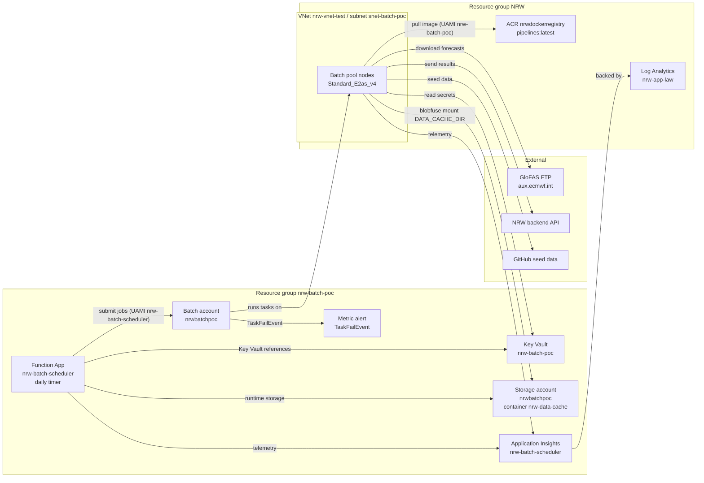

# Pipeline cloud deployment plan

The general requirements this plan implements are in [readme-requirements.md](readme-requirements.md); this document is the practical implementation overview.

For usage, such as deploying changes or kicking off a deployed pipeline run from the CLI, see `Deployment steps and scripts`.

## Azure resources

### Resource group `nrw-batch-poc`

- **Batch account** `nrwbatchpoc` — AAD-only authentication, Key Vault-based node pool credential management. Treated as a **permanent resource** rather than deployed on-the-fly, to avoid single points of failure.
  - **Batch pool** `nrwbatchpoc` — container-enabled VM Configuration pool (container support must be enabled at pool creation); `Standard_E2as_v4`, Ubuntu HPC 24.04 (`publisher: microsoft-dsvm`, `offer: ubuntu-hpc`, `sku: 2404`, `version: latest`), blobfuse mount of `nrw-data-cache`, autoscale (max 2 nodes, evaluated every 5 min). Jobs use the `nrw-batch-poc` UAMI on every node to authenticate to Azure resources; the pipeline itself only talks to the NRW backend API, so no direct database access from the nodes is needed.
- **Key Vault** `nrw-batch-poc` — RBAC permission model; holds `ibf-pipeline-api-key`, `glofas-ftp-user`, `glofas-ftp-password`.
- **Storage account** `nrwbatchpoc` — general-purpose V2; Blob container `nrw-data-cache` (mounted as `DATA_CACHE_DIR`, lifecycle policy from `blob-lifecycle-policy.json`, receives Batch task stdout/stderr under `task-logs/`); also reused as Function App runtime storage (`AzureWebJobsStorage`).
- **User-assigned managed identity** `nrw-batch-poc` — pool node identity (restricted to Batch providers).
- **User-assigned managed identity** `nrw-batch-scheduler` — dedicated Function App identity.
- **App Service plan** `nrw-batch-scheduler-plan` — Linux Consumption (Y1).
- **Function App** `nrw-batch-scheduler` — Python 3.11; daily job scheduler; app settings resolve secrets via Key Vault references.
- **Application Insights** `nrw-batch-scheduler` — workspace-based component (in this RG) backed by the shared `nrw-app-law` workspace.
- **Action group** `nrw-batch-scheduler-task-fail` — email receiver for task failures.
- **Metric alert** `nrwbatchpoc-task-fail-event` — fires on `TaskFailEvent` > 0 on the Batch account (5 min window).
- **Action group** `nrw-batch-scheduler-event-created` — email receivers for expected events (placeholder, see below).
- **Scheduled query alert** `nrw-batch-scheduler-event-created` — hourly query on the pipeline traces for the `placeholder_email_alert` tag. TODO: remove once event notifications are handled by the backend/app.

### Resource group `NRW`

- **Container registry** `nrwdockerregistry` (login server `nrwdockerregistry.azurecr.io`) — hosts the pipeline image `nrwdockerregistry.azurecr.io/pipelines:latest` (build context: repo root `/data`; also hosts the featureserv image). The Batch pool is attached to the registry and prefetches `pipelines:latest` so tasks start quickly.
- **Virtual network** `nrw-vnet-test` — subnet `snet-batch-poc`, NSG `nrw-NSG-test`; `nrw-vnet-prod` also exists. The subnet must **not** have any subnet delegation: a VM Configuration pool deploys a VM Scale Set into the subnet, and a delegation (e.g. to `Microsoft.Batch/batchAccounts`, which only applies to the deprecated Cloud Services Configuration pool type) reserves the subnet for that service and makes node allocation fail with `AllocationFailed` / "subnet has delegation to external resources". Remove it with `az network vnet subnet update --resource-group NRW --vnet-name nrw-vnet-test --name snet-batch-poc --remove delegations`. Pool tasks reach the NRW backend API privately (exact connectivity — private endpoint, VNet peering, service endpoint, or public routing — depends on how the API is deployed).
- **Log Analytics workspace** `nrw-app-law` — shared with the NRW backend; backs the Application Insights component.

## Deployment diagram

## Permissions

- Subscription: `57b0d17a-5429-4dbb-8366-35c928e3ed94`
- Key Vault scope: `/subscriptions/57b0d17a-5429-4dbb-8366-35c928e3ed94/resourceGroups/nrw-batch-poc/providers/Microsoft.KeyVault/vaults/nrw-batch-poc`
- Batch account scope: `/subscriptions/57b0d17a-5429-4dbb-8366-35c928e3ed94/resourceGroups/nrw-batch-poc/providers/Microsoft.Batch/batchAccounts/nrwbatchpoc`

Azure accounts

- **`nrw-batch-scheduler`** (Function App UAMI — ServicePrincipal):
  - Role: `Key Vault Secrets User`; Scope: Key Vault `nrw-batch-poc`; Why: resolve the Key Vault app-setting references in the Function App.
  - Role: `Azure Batch Job Submitter`; Scope: Batch account `nrwbatchpoc`; Why: create Batch jobs over Entra ID (account is AAD-only).
- **`nrw-batch-poc`** (pool node UAMI — ServicePrincipal):
  - Role: `Key Vault Secrets User`; Scope: Key Vault `nrw-batch-poc`; Why: pool nodes read secrets from the vault.
  - Role: `Storage Blob Data Contributor`; Scope: Blob container `nrw-data-cache` on storage account `nrwbatchpoc`; Why: Blob mount used as `DATA_CACHE_DIR`, and stdout/stderr upload by the Batch node agent.
  - Role: `AcrPull`; Scope: container registry `nrwdockerregistry` (`NRW` resource group); Why: pool nodes pull `pipelines:latest` with this identity.
- **`Microsoft Azure Batch`** (service principal — ServicePrincipal):
  - Role: `Azure Batch` (orchestration); Scope: subscription; Why: Batch account provisioning (portal setup).
  - Role: `Key Vault Secrets Officer`; Scope: Key Vault `nrw-batch-poc`; Why: Batch account uses the vault for node pool credential management (portal setup).

User accounts:

- **Create and rotate pipeline secrets**
  - Role: `Key Vault Secrets Officer`; Scope: Key Vault `nrw-batch-poc`
- **To run `func start`**
  - Role: `Azure Batch Job Submitter`; Scope: Batch account `nrwbatchpoc`; Why: local job submission uses the operator's own `az login` identity, not the scheduler UAMI.
- **To run `function/run_pipeline_job.sh` or `function/mock_run_pipeline_job.sh`**
  - Role: `Key Vault Secrets User`; Scope: Key Vault `nrw-batch-poc`
  - Role: `Azure Batch Job Submitter`; Scope: Batch account `nrwbatchpoc`
- **To run `create-pool.sh`**
  - Role: `Azure Batch Data Contributor`; Scope: Batch account `nrwbatchpoc`; Why: pool delete/create are data-plane operations authenticated with the operator's `az login` Entra ID token; `Azure Batch Job Submitter` cannot manage pools.
  - Role: `Contributor`; Scope: Batch account `nrwbatchpoc`; Why: attaching the pool managed identity goes through the management API (`az rest PATCH`).

## Deployment steps and scripts

All files live under `data/pipelines/deploy/`.

### One time setup

- `set-secrets.sh` — store pipeline secrets in Key Vault. (If rerun this on a live instance, you need to restart the function app. (`az functionapp restart --name nrw-batch-scheduler --resource-group nrw-batch-poc`))
- Create `nrw-batch-scheduler` UAMI + grant its roles (manual CLI) — dedicated Function identity plus `Key Vault Secrets User` and `Azure Batch Job Submitter` grants.
- Grant the `nrw-batch-poc` pool UAMI its roles (manual CLI) — `Key Vault Secrets User`, `Storage Blob Data Contributor`, and `AcrPull` on `nrwdockerregistry` (see Permissions above).
- `apply-lifecycle.sh` (`blob-lifecycle-policy.json`) — apply the Blob Storage retention policy.
- `create-pool.sh` (`pool.json`) — create/recreate the Batch pool with the blob mount configured.

These run once on first setup (and only again on rotation/policy changes).

### Deploy to Azure

Run these in order the first time, but after that, you can just run the ones that are updated.

1. `build-and-push-image.sh` — build & push the pipeline Docker image to ACR. Note that YAML configs (`pipelines/infra/configs/*.yaml`) are baked into the image, so adding a country or changing data sources requires a new build+push.
2. `deploy.sh` (`main.bicep`, `parameters.dev.json`) — deploy the Function App + monitoring (Bicep). Be sure to set the correct `.env` variables before running this, such as `IBF_API_URL`.
3. `publish-function.sh` (`function/`) — deploy the Azure Function code and it's dependencies (from data/pipelines/deploy/function/).

### Helper jobs

- `run_pipeline_job.sh` (`function/run_pipeline_job.sh`): Manually kick off a hazard pipeline run for a given hazard. Example: `./function/run_pipeline_job.sh floods`. This is the same job and parameters as a standard scheduled run of the hazard.
- `mock_run_pipeline_job.sh` (`function/mock_run_pipeline_job.sh`): Run the pipeline with mock data; `--mock` is required and all other arguments are passed through unchanged. See the [pipelines readme](../pipelines/README.md) for possible flags. `./function/mock_run_pipeline_job.sh floods --mock 1 --country KEN`

## Storage

- **Azure Blob Storage**: GloFAS global downloads (~600 MB per file, ~30 GB total for a daily set of ~50 files), country split outputs, debug/dev data, and large result payloads. Only one GloFAS file is loaded at a time, so peak working storage is ~600 MB–1 GB. All downloaded GloFAS files are written to Blob Storage.

### Blob storage retention

The pipeline writes to subdirectories under `DATA_CACHE_DIR` as defined in `pipelines/infra/utils/storage_helpers.py`. Azure Blob lifecycle policies apply per prefix; finite retentions are enforced by `data/pipelines/deploy/blob-lifecycle-policy.json`, while indefinite retentions rely on the default (no rule in that file). NOAA data is not yet integrated into the pipeline, so it is not referenced here yet.

- `glofas/raw/{forecast_date}/`
  - Content: global GloFAS downloads
  - Retention: 30 days
- `glofas/country_split/{forecast_date}/`
  - Content: country-split GloFAS data (for development)
  - Retention: indefinite (revisit later)
- `glofas/country_split_alert/{forecast_date}/`
  - Content: country-split data that triggered alerts
  - Retention: indefinite
- `task-logs/{hazard_type}/{job_id}/`
  - Content: Batch task stdout/stderr files
  - Retention: 90 days

## Logging

Logging uses a workspace-based **Application Insights** component (`nrw-batch-scheduler`) backed by the shared **`nrw-app-law`** Log Analytics workspace in the `NRW` resource group

## Network requirements

- Batch nodes must reach the App Insights ingestion endpoint (HTTPS 443 to `dc.services.visualstudio.com`, covered by the `AzureMonitor` service tag).

Connectivity notes for the pool subnet (`snet-batch-poc`):

- **Private endpoints / DNS** — if the NRW API or ACR uses a private endpoint, link the corresponding **Private DNS Zone** (e.g. `privatelink.azurewebsites.net`) to `nrw-vnet-test` so DNS resolves correctly.
- **Blob Storage** — the blobfuse mount works over HTTPS (443); add a service endpoint or private endpoint for `Microsoft.Storage` on the subnet if public access is restricted.

#### NSG / firewall rules

The subnet's NSG is `nrw-NSG-test`. It currently has no custom outbound rules, so Azure defaults allow the required outbound traffic. If the NSG is later locked down, explicitly allow:

- HTTPS (443) to the ACR (`nrwdockerregistry.azurecr.io`) and Blob Storage (`nrwbatchpoc.blob.core.windows.net`).
- FTP control (port 21) and passive data ports (1024–65535) to `aux.ecmwf.int`.

## Environment variables and secrets

### Env vars

Set these in `data/.env`. See `data/.env.example` for which need to be set and which don't for production.

### Key Vault secrets

- `ibf-pipeline-api-key` — API key for the NRW backend (`IBF_PIPELINE_API_KEY`).
- `glofas-ftp-user` — ECMWF GloFAS FTP username (`GLOFAS_FTP_USER`).
- `glofas-ftp-password` — ECMWF GloFAS FTP password (`GLOFAS_FTP_PASSWORD`).

## Out of scope for first prototype

### To do or evaluate after first prototype is running

- **Additional environments**: Only `test` (`IBF_ENVIRONMENT=test`) is used for the prototype. Adjust scripts so they correctly handle other environments. ([Task 44420](https://dev.azure.com/redcrossnl/National%20Risk%20Watch/_workitems/edit/44420))
- **Logging and retention**: Re-eval retention periods for logs and files. ([Task 44421](https://dev.azure.com/redcrossnl/National%20Risk%20Watch/_workitems/edit/44421))
- **"no run" Alerts**: Set up alerts if there were no runs ([Task 44422](https://dev.azure.com/redcrossnl/National%20Risk%20Watch/_workitems/edit/44422))
- **Test Batch account**: Limit mock data runs to a specific account/env to prevent mock runs ever being done on PROD or with non-mock accounts. ([Task 44423](https://dev.azure.com/redcrossnl/National%20Risk%20Watch/_workitems/edit/44423))
- **CI/CD image builds**: Use Github actions to build and push to ACR. ([Task 44424](https://dev.azure.com/redcrossnl/National%20Risk%20Watch/_workitems/edit/44424))
- Re-evaluate the pool autoscale formula ([Task 44425](https://dev.azure.com/redcrossnl/National%20Risk%20Watch/_workitems/edit/44425))

### Specs to evaluate

Tracked in [Task 44426](https://dev.azure.com/redcrossnl/National%20Risk%20Watch/_workitems/edit/44426).

- Be sure the nrw-batch-scheduler runs are safely within the `working memory` limit of 1.5 GB, which can be seen on the [nrw-pipelines-test-rg resource page.](https://portal.azure.com/#@rodekruis.onmicrosoft.com/resource/subscriptions/57b0d17a-5429-4dbb-8366-35c928e3ed94/resourceGroups/nrw-pipelines-test-rg/metrics)
- Check the memory and cpu usage of the backend to make sure the pipeline is not causing usage spikes. For example, you can see this [here for nrw-test.](https://portal.azure.com/#@rodekruis.onmicrosoft.com/resource/subscriptions/57b0d17a-5429-4dbb-8366-35c928e3ed94/resourceGroups/NRW/providers/Microsoft.Web/serverfarms/nrw-test/metrics)

### Handle after MVP or as need arises

- **Data caching**: There are two types of data we could cache: PostGis DB data (admin areas, roads, buildings) and static data (population source image). For now, it is pulled from the backend.
